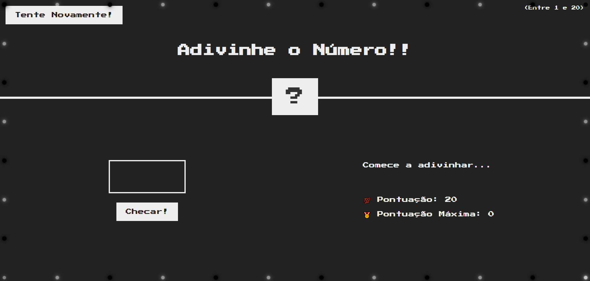

# 🎯 Adivinhe o Número!!

Um jogo interativo de adivinhação desenvolvido com **HTML, CSS e JavaScript puro**, no qual o jogador precisa descobrir um número secreto entre 1 e 20 antes que sua pontuação chegue a zero.

O projeto foi desenvolvido como parte dos meus estudos em desenvolvimento web, com foco em lógica de programação, manipulação do DOM, eventos JavaScript e criação de interfaces responsivas.

## 🎮 Demonstração

<!-- Adicione aqui um GIF ou uma captura de tela do projeto -->



> 💡 Você pode substituir a imagem acima por uma captura de tela ou GIF do jogo em funcionamento. Basta adicionar o arquivo ao repositório e atualizar o caminho.

## 🚀 Funcionalidades

* 🎲 **Número secreto aleatório:** o jogo sorteia um número entre 1 e 20 a cada nova partida.
* 🔢 **Validação de entrada:** limita os valores inseridos pelo jogador ao intervalo permitido.
* 💯 **Sistema de pontuação:** o jogador começa com 20 pontos e perde um ponto a cada tentativa incorreta.
* 🏆 **Highscore:** registra a maior pontuação alcançada durante a sessão atual.
* 🔄 **Reiniciar partida:** permite iniciar um novo jogo sem perder o recorde da sessão.
* 🎨 **Feedback visual dinâmico:** a interface muda de cor quando o jogador acerta o número secreto.
* 🎪 **Animação de luzes:** decoração com luzes coloridas inspiradas em letreiros de circo.
* 📱 **Layout responsivo:** interface adaptada para diferentes tamanhos de tela, incluindo desktops, tablets e dispositivos móveis.

## 🛠️ Tecnologias utilizadas

| Tecnologia              | Aplicação                                               |
| ----------------------- | ------------------------------------------------------- |
| HTML5                   | Estruturação da interface do jogo                       |
| CSS3                    | Estilização, responsividade e animações                 |
| JavaScript (Vanilla JS) | Lógica do jogo, eventos, pontuação e manipulação do DOM |
| Google Fonts            | Tipografia retrô com a fonte Press Start 2P             |

## 🧠 Conceitos praticados

Durante o desenvolvimento deste projeto, foram explorados conceitos fundamentais do desenvolvimento web:

* Declaração e manipulação de variáveis (`let` e `const`).
* Geração de números aleatórios com `Math.random()` e `Math.trunc()`.
* Estruturas condicionais (`if`, `else if` e `else`).
* Manipulação do DOM com `document.querySelector()`.
* Eventos JavaScript com `addEventListener()`.
* Captura e validação de dados de entrada.
* Atualização dinâmica de conteúdo HTML.
* Manipulação de estilos CSS por meio do JavaScript.
* Implementação de sistemas de pontuação e recordes.
* Desenvolvimento de layouts responsivos com Media Queries.
* Animações CSS utilizando `@keyframes`.

## ⚙️ Como executar o projeto

Não é necessário instalar dependências ou configurar um ambiente de backend para executar o jogo.

### 1. Clone o repositório

```bash
git clone https://github.com/tiagotpk/jogo_adivinha.git
```

### 2. Acesse a pasta do projeto

```bash
cd PASTA-DESTINO
```

### 3. Execute o projeto

Abra o arquivo `index.html` diretamente no navegador.

Se estiver utilizando o Visual Studio Code, você também pode executar o projeto com a extensão **Live Server**.

## 📂 Estrutura do projeto

```text
adivinhe-o-numero/
│
├── index.html       # Estrutura principal do jogo
├── style.css        # Estilos, responsividade e animações
├── script.js        # Lógica e funcionalidades do jogo
├── assets/
│   └── screenshot.png
│
└── README.md        # Documentação do projeto
```

> A estrutura `assets/` é utilizada para armazenar imagens e outros recursos visuais, como a captura de tela da demonstração.

## 🎯 Objetivo do projeto

O principal objetivo deste projeto foi colocar em prática os fundamentos de JavaScript por meio de uma aplicação interativa, desenvolvendo o raciocínio lógico e a capacidade de transformar requisitos em funcionalidades reais.

Além disso, o projeto representa uma etapa da minha evolução como desenvolvedor, reforçando meus conhecimentos em desenvolvimento Front-End e boas práticas de organização de código.

## 🔮 Melhorias futuras

Algumas funcionalidades que podem ser exploradas em versões futuras:

* [ ] Persistir o highscore utilizando `localStorage`.
* [ ] Adicionar efeitos sonoros durante as partidas.
* [ ] Criar diferentes níveis de dificuldade.
* [ ] Aprimorar as animações e os efeitos visuais.
* [ ] Implementar um ranking de melhores pontuações.
* [ ] Melhorar a acessibilidade e a experiência em dispositivos móveis.

## 👨‍💻 Autor

**Tiago Henrique dos Reis**

Desenvolvedor em formação, atualmente focado em aprimorar minhas habilidades em JavaScript, desenvolvimento web e construção de aplicações práticas.

🔗 [GitHub](https://github.com/tiagotpk)

🔗 [LinkedIn](https://www.linkedin.com/in/tiagotpk/)

---

⭐ Se você gostou do projeto, considere deixar uma estrela no repositório!
